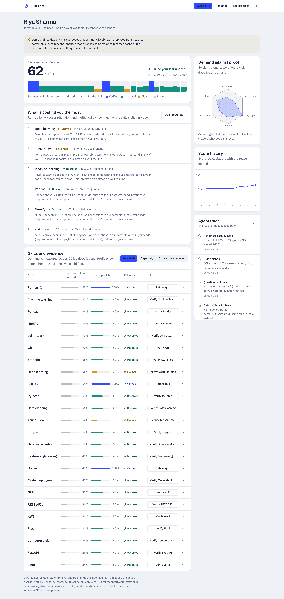
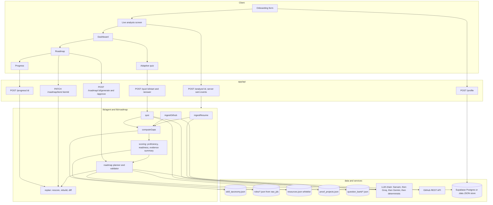
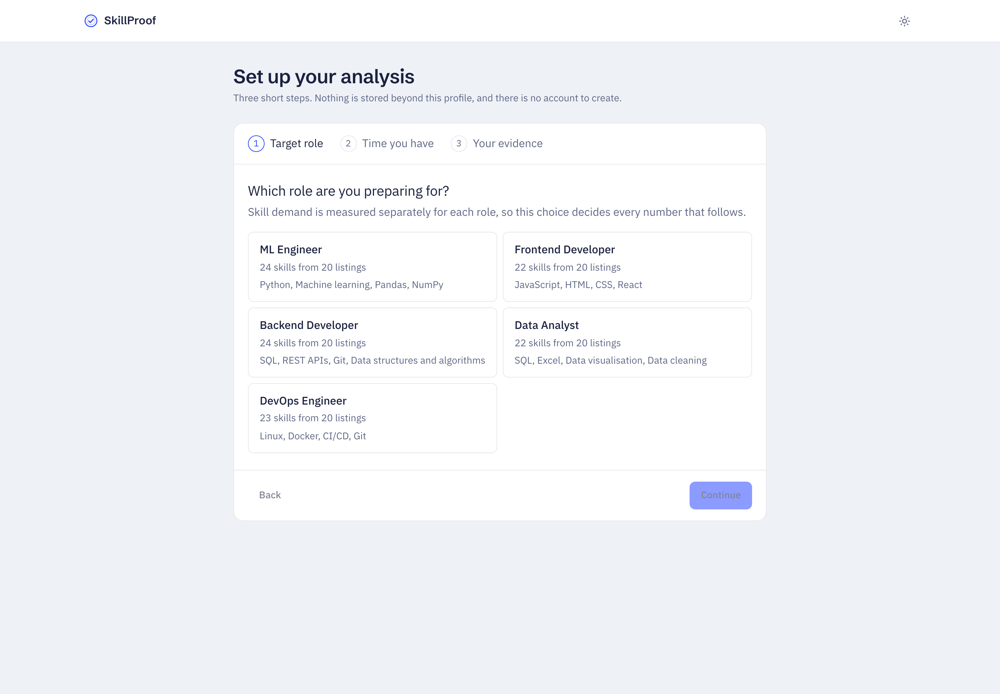
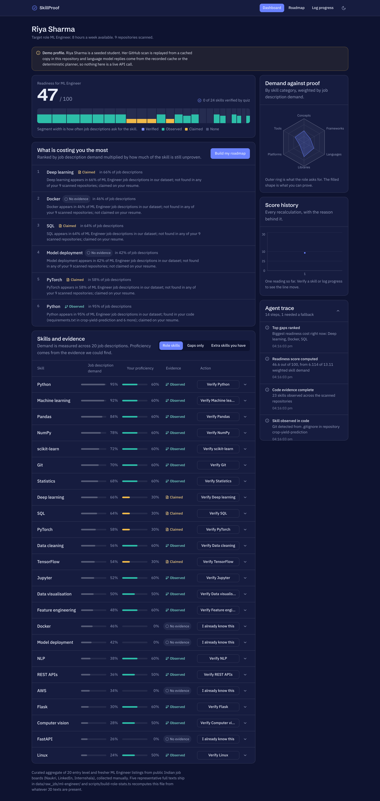


# SkillProof

Skills proven, not claimed. SkillProof turns a student profile into a measurable
readiness score for a target role, explains every gap with the evidence behind
it, and builds an adaptive week by week roadmap that replans itself as the
student proves things.

Built for Bit N Build 2026, UP Regionals, problem statement 05: education and
employability.



## The problem

> Students often know the role they want but do not know which skills they lack,
> what projects demonstrate those skills, or how to prioritize learning. Build an
> AI career agent that converts a student's current profile into a measurable and
> adaptive roadmap.

Two things go wrong with the usual answer to this. First, skills are taken on
trust: a resume that lists PyTorch is treated the same as a repository that
imports it. Second, roadmaps are generic: the same eight week plan is handed to
every student regardless of what they can already prove.

## The approach

SkillProof separates what a student **claims** from what they can **prove**, and
prices every gap against real job description demand.

1. **Collect evidence.** The resume gives claimed skills. Public GitHub
   repositories give observed skills, recorded down to the file that proved each
   one. A four question adaptive quiz gives verified skills.
2. **Price the gaps.** Each role has a skill demand table built from job
   descriptions. Readiness is the demand weighted share of the role the student
   can prove.
3. **Plan against the evidence.** Gaps are ordered by how much readiness they
   cost, sequenced by prerequisite, packed into the student's weekly hour budget,
   and each one ends in a proof project.
4. **Replan on proof.** A quiz result, a new repository or a finished item
   recalculates the score and rebuilds the remaining weeks, leaving anything the
   student edited alone.

## Key features

| Feature             | What it does                                                                                                                             |
| ------------------- | ---------------------------------------------------------------------------------------------------------------------------------------- |
| Evidence levels     | Every skill is `claimed`, `observed`, `verified` or missing, with the badge shown everywhere                                             |
| Readiness score     | 0 to 100, weighted by how often each skill appears in job descriptions for the role                                                      |
| Explainable gaps    | "Docker appears in 46% of ML Engineer job descriptions; not found in any of your 9 scanned repositories; not claimed on your resume"     |
| Proof projects      | Each roadmap item ends in a small portfolio project with 3 to 5 checkable acceptance criteria, usually covering two gaps                 |
| Adaptive quiz       | Four questions per skill, harder after a correct answer, easier after a wrong one, scored by difficulty weight                           |
| Human in the loop   | Approve the roadmap, edit or skip items, reorder within a week, change your hours, or say "I already know this" and prove it with a quiz |
| Adaptive replanning | Every progress event recalculates the score, writes a history point with its reason, and shows a "what changed" diff                     |
| Agent trace         | Every step the agent took, including the ones that failed and what it did instead                                                        |

## How this meets the theme

| Theme requirement        | Where it lives                                                                                                                                                         |
| ------------------------ | ---------------------------------------------------------------------------------------------------------------------------------------------------------------------- |
| AI reasoning             | `lib/llm/index.ts` (one entry point over Sarvam, Groq and Gemini), `lib/agent/ingestResume.ts`, `lib/agent/quiz.ts`, `lib/roadmap/prompt.ts`                           |
| Real world data and APIs | `data/roles/*.json` and `data/raw_jds/` (job description demand), `lib/github/scan.ts` (GitHub REST), `lib/resume/pdf.ts` (PDF upload)                                 |
| Persistent state         | `lib/db/` with one interface over Supabase and a local JSON store, schema in `supabase/schema.sql`                                                                     |
| Explainability           | `lib/scoring/evidence-summary.ts` builds every explanation from counted evidence, `components/dashboard/skill-row.tsx` shows the repository and file behind each skill |
| Human in the loop        | `lib/services/roadmap-service.ts` (approve, edit, skip, reorder), `components/roadmap/roadmap-view.tsx`, `app/progress/[id]`                                           |
| Graceful failure         | `lib/llm/index.ts` fallback chain, `lib/agent/ingestGithub.ts` resume only path, `lib/agent/quiz.ts` question bank fallback, `lib/db/json-store.ts`, `app/error.tsx`   |

## Architecture



## Tech stack

Next.js 14 App Router, TypeScript in strict mode, Tailwind CSS with a custom
token system, shadcn/ui style components on Radix primitives, Recharts,
Supabase Postgres, a three provider model chain (Sarvam AI, then Groq, then
Google Gemini), zod for every boundary, Vitest, pnpm, deployed on Vercel.

## Running it

```bash
git clone <this repo>
cd skillproof
pnpm install
cp .env.example .env.local     # every value is optional, see below
pnpm dev                       # http://localhost:3000
```

Open the home page and press **Load demo profile**. That works with no keys, no
database and no network.

### Environment variables

| Variable                                                   | Needed for                                                                           | Without it                                                                |
| ---------------------------------------------------------- | ------------------------------------------------------------------------------------ | ------------------------------------------------------------------------- |
| `SARVAM_API_KEY`                                           | Primary provider, Sarvam AI `sarvam-105b`                                            | The chain drops to Groq                                                   |
| `GROQ_API_KEY`                                             | First fallback, `openai/gpt-oss-120b` on the free tier                               | The chain drops to Gemini                                                 |
| `GEMINI_API_KEY`                                           | Second fallback, `gemini-3.8-flash` on the free tier                                 | The chain drops to deterministic logic                                    |
| `LLM_PRIMARY`                                              | Promotes one provider to the front of the chain                                      | Order is Sarvam, then Groq, then Gemini                                   |
| `GITHUB_TOKEN`                                             | Raising the GitHub rate limit from 60 to 5000 requests an hour                       | Scans are capped at 8 repositories and rate limits degrade to resume only |
| `NEXT_PUBLIC_SUPABASE_URL` and `SUPABASE_SERVICE_ROLE_KEY` | Storing profiles in Postgres                                                         | Everything is written to a local JSON store in `.data/`                   |
| `DEMO_MODE`                                                | Recording model replies into `data/demo/llm_cache.json` and labelling the deployment | Off                                                                       |

With no provider key at all the product still runs end to end: the deterministic
planner, keyword resume parsing and the stored question bank take over, and the
agent trace says which path each step took.

### With Supabase

Create a project, open the SQL editor, run `supabase/schema.sql`, then put the
project URL and the service role key in `.env.local`. The service role key is
only ever read in server code.

### Useful commands

```bash
pnpm test         # 59 unit tests over the deterministic core
pnpm typecheck    # strict TypeScript, zero any
pnpm lint         # ESLint with the project rules
pnpm build:roles  # recompute role skill frequencies from data/raw_jds
pnpm demo:verify  # replay the whole demo storyline against a running server
pnpm screenshots <profileId>  # capture docs/screenshots in both themes
```

## Screenshots

|               |                                                                  |
| ------------- | ---------------------------------------------------------------- |
| Dashboard     |        |
| Roadmap       |            |
| Adaptive quiz |                  |
| Onboarding    |           |
| Log progress  |          |
| Dark theme    |    |
| Phone width   |  |

## Demo mode

The demo profile is a seeded student, Riya Sharma, targeting ML Engineer. Her
resume text and a cached scan of nine repositories live in `data/demo/`. Demo
mode is labelled in the interface and in this README because cached output must
never be presented as a live API call.

The storyline, which `pnpm demo:verify` replays end to end:

| Step                                                      | Readiness |
| --------------------------------------------------------- | --------- |
| Analysis of resume and GitHub                             | 46.6      |
| Python quiz, 100%                                         | 49.5      |
| SQL quiz, 25%, claimed but weak                           | 49.3      |
| Roadmap generated and approved                            | 49.3      |
| Two items marked done, no evidence yet                    | 49.3      |
| New repository linked, Docker and deployment now observed | 56.3      |
| Docker quiz, 100%                                         | 58.0      |
| SQL retaken after learning, 100%                          | 61.7      |

Marking an item done deliberately does not move the score. Proof does.

## Graceful failure

| Failure                           | What happens                                                                                                                                                                     |
| --------------------------------- | -------------------------------------------------------------------------------------------------------------------------------------------------------------------------------- |
| Model returns invalid JSON        | zod rejects it, one retry carries the validation error back to the model, then the next provider in the chain, then deterministic logic. Each step is written to the agent trace |
| A provider reports a rate limit   | The chain moves on immediately rather than waiting out a free tier window, and the trace records the switch                                                                      |
| Model times out after 20 seconds  | Same chain                                                                                                                                                                       |
| No API key at all                 | Deterministic planner, keyword resume extraction and the stored question bank run the whole product                                                                              |
| GitHub rate limit or unknown user | Analysis continues with resume evidence only, with a warning in the trace and a banner on the dashboard                                                                          |
| Resume PDF is a scan with no text | The upload is rejected with a message asking for pasted text                                                                                                                     |
| No Supabase credentials           | Local JSON store in `.data/`, written atomically through one queue                                                                                                               |
| Quiz generation fails             | Falls back to `data/question_bank/<skill>.json` for ten common skills                                                                                                            |
| A page throws                     | `app/error.tsx` shows what happened and offers a retry, never a blank screen                                                                                                     |

## Design decisions

**Three providers, all optional.** Sarvam AI is primary: an Indian platform for
an Indian student problem, and its signup credits cover the whole build. Groq and
Gemini follow on their free tiers. Sarvam and Groq are both OpenAI shaped, so one
adapter serves both, and the order is set by `LLM_PRIMARY` rather than by code.

**Scoring is deterministic, the model only writes prose.** Readiness, proficiency
and gap order are plain TypeScript in `lib/scoring/`. A model that hallucinates
can produce a bad sentence, never a bad score. It also means the same profile
always produces the same number, which is what makes the score arguable.

**Three evidence levels instead of a single confidence number.** "Claimed,
observed, verified" maps onto what a recruiter actually asks: did you write it
down, did you build with it, can you answer questions about it. A single 0 to 1
number hides which of those is true.

**Learning resources are whitelisted.** The model may only pick URLs from
`data/resources.json`, and anything else is dropped in `lib/roadmap/validate.ts`.
An invented documentation link is the most likely hallucination a student would
actually click, and every committed link was checked for a live response.

**Quiz answers never reach the browser before the answer does.** The correct
index and the explanation stay in the attempt row on the server;
`ClientQuizQuestion` is the type that crosses the boundary.

**Marking an item done does not raise the score.** The whole premise is that
claims are not proof. Finishing an item records progress and replans the rest;
the score moves when a repository or a quiz proves the skill.

**Edited items are locked.** Any item a student touches is copied into the next
roadmap version untouched. The agent replans the future, not the student's
decisions.

**`profiles.github_summary` was added to the given schema.** Evidence summaries
cite "not found in any of your 9 scanned repositories", and that count cannot be
recovered from `skill_evidence`, which only stores repositories that produced a
hit.

## Dataset honesty

`data/roles/*.json` holds skill frequencies for five roles. Each file is a
curated aggregate of about 20 entry level listings from public Indian job boards,
collected by hand, and five representative full texts per role ship in
`data/raw_jds/`. The frequencies are a defensible sample, not a scraped census.

The pipeline is real: drop more JD text files into `data/raw_jds/<role>/` and run
`pnpm build:roles` to recompute the frequencies by matching against
`data/skill_taxonomy.json`. Running it without `--write` prints a comparison
table between the committed numbers and what the shipped texts alone produce.

## Limitations

- Skill detection reads dependency manifests, file names, languages and topics.
  It cannot tell good code from bad code, only that the skill is present.
- README mentions count as evidence for concepts such as feature engineering,
  where there is no dependency to find. That is weaker evidence than an import.
- Quizzes are four questions. They separate "cannot answer anything" from "knows
  this well", not fine grained levels.
- The JD dataset is a sample of Indian entry level listings and is not live.
- There is no authentication. A profile URL is the capability to read it.

## Future scope

- A placement cell dashboard: cohort level gaps for a college, so training can be
  planned against real demand rather than intuition.
- Live job description ingestion from LinkedIn and Naukri, replacing the curated
  sample with a weekly refresh through the same pipeline.
- Hindi and regional language interface, since the students who need this most
  are not always comfortable reading technical English.
- Mentor review: a senior engineer signs off a proof project, which becomes a
  fourth evidence level above verified.
- Proof project verification by scanning the submitted repository against the
  acceptance criteria automatically.
